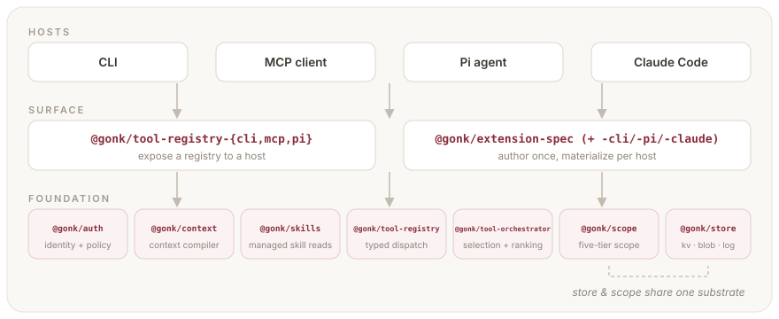
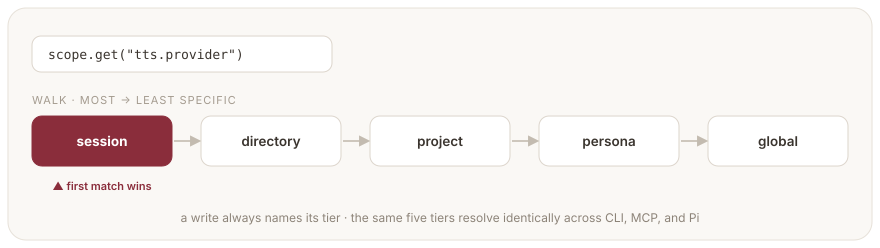

# gonk

> **Write an agent capability once. Run it in every host.** The lingua franca that ends the rewrite — define a tool against a small set of host-agnostic primitives, and surface it natively through the CLI, an MCP server, a Pi agent, or Claude Code.

  

## Why

If you build agent tools, you write them against whatever host you're in — a Claude Code plugin, a Pi extension, an MCP server — and then rewrite them when you move. gonk ends that. Define a tool once against a typed registry; expose it through a CLI, an MCP server, or a Pi agent **without changing a line**; and let it read and write config through one scope chain that resolves the same way everywhere. Build a capability on these primitives and it ships once, runs everywhere.

Every harness has grown strengths the others lack — [Hermes](https://github.com/nousresearch/hermes-agent)'s session-surviving memory, [Pi](https://github.com/earendil-works/pi)'s clean extension model, Claude Code's plugins, Codex's sandboxed loop — and reusing any of them today means porting it by hand to the next host. gonk is the lingua franca that makes a capability portable instead.

This repo is the foundation — identity and authorization, deterministic context
compilation, authorized retrieval, managed skills, the registry, scope, host
adapters, and persistence beneath them.
Build capabilities on these primitives and they ship once, to run on any host.

## Architecture

<p align="center"></p>

The foundation primitives, each its own package, plus an authoring layer on top of them:

- **Authentication and authorization** — [`@gonk/auth`](packages/core/auth). Transport-independent effective-subject and delegation contracts, opaque session/persistent-grant binding keys, authorization policy inputs, and redacted security receipts. Hosts prove identity; Gonk carries and enforces it without importing a provider SDK.
- **Context compilation** — [`@gonk/context`](packages/core/context). Registered
  contributors nominate serializable candidates; Core authorizes discovery before
  resolution, reauthorizes authoritative use, deduplicates canonical resources,
  budgets deterministically, and returns either a sendable artifact or a blocked
  result with a content-free receipt.
- **Authorized retrieval** — [`@gonk/retrieval`](packages/core/retrieval).
  In-process native/coordinated sources, immutable lexical index generations,
  Core-owned or source-conformant authorization-before-ranking, authoritative
  content resolution, stable citations, and redacted domain receipts.
- **Managed skills** — [`@gonk/skills`](packages/core/skills). Canonical read and authorized writable lifecycle contracts over five scope tiers, with deterministic shadowing, hidden staging/archive stores, restart-durable security-bound mutation/activation receipts, strict path handling, typed tags/provenance/freshness, stable revisions, and a reusable conformance suite.
- **Tool definitions** — [`@gonk/tool-registry`](packages/core/tool-registry). A tool is a typed handler with Standard Schema I/O and a self-declared approval tier (`read` / `write` / `exec`). Define it once; every adapter below can surface it.
- **Scope** — [`@gonk/scope`](packages/core/scope). One resolution chain, five tiers, multi-root and symlink-aware. Tools never invent their own config storage; they read and write namespaced keys through scope and inherit the resolution for free.
- **Persistence** — [`@gonk/store`](packages/core/store). The same idea for *data* that scope is for *config*: KV, blob, append-log, and vector-KNN primitives a capability reads and writes without knowing — or caring — whether the backing is the filesystem, a database, or a vector index. Pure-`fs` by default, swappable underneath without touching a caller.
- **Connectivity address & identity** — [`@gonk/channel`](packages/core/channel). The transport-agnostic message contract underneath cross-agent comms and the remote front doors: an address-on-the-message envelope (`persona@host#scope`), a channel registry, and a loopback reference impl.
- **Time & activity** — [`@gonk/temporal`](packages/core/temporal). The temporal-awareness surface (wall-clock, session elapsed, turn index, idle) plus the periodic-run scheduler and persistent-presence wake/defer policy that every "should this fire now?" decision reads.
- **Adapters** — [`@gonk/tool-registry-{cli,mcp,pi}`](packages/adapters). Each exposes the *same* registry + orchestrator to a different host, so a capability ships once and surfaces everywhere.
- **Extension authoring** — [`@gonk/extension-spec`](packages/framework/extension-spec) (+ `-cli` / `-pi` / `-claude` / `-codex`). Declare a whole extension — slash commands, settings UIs, presets, and tools — as host-agnostic data, then materialize it into a CLI extension, a Pi extension, a Claude Code plugin tree, or a Codex plugin tree. Built on the registry and scope primitives above.

`@gonk/tool-orchestrator` sits on top of the registry for semantic selection (`find_tools`, `load_tool`, …) when a host carries more tools than it wants visible at once.

The fastest authoring path is in [Tool authoring](docs/tool-authoring.md):
write a `ToolDefinition` with a Standard Schema input, attach one JSON Schema
projection to that same schema value for MCP, declare `approval: "read" |
"write" | "exec"`, and mount the registry through the adapter your host needs.

## Scope resolution

Every tool you write inherits config resolution for free — no config-file plumbing, no per-host storage code. A read with no tier named walks **most → least specific** and returns the first match; a write always names its tier. The same five tiers resolve identically across CLI, MCP, and Pi.

<p align="center"></p>

A worked example — Gimble, the example persona, keeps a voice preference at the persona tier, and a session override wins without erasing it:

```ts
import { FsScopeStore } from "@gonk/scope/fs";

const scope = new FsScopeStore({ cwd: process.cwd() });

scope.set("tts.provider", "mlx-cloning", "persona");  // a standing preference
scope.set("tts.provider", "openai", "session");        // a one-off override

scope.get("tts.provider");      // → "openai"  (session is most specific)
scope.resolve("tts.provider");  // → every tier where it is set, most → least specific
```

> The `persona`-tier value travels with the agent across hosts; the `session` override stays temporary and local.

## Package reference

New here? Application scaffolds can import **`@gonk/core`** for the common
auth + scope + registry surface. Published libraries and host adapters should
usually import the focused package they actually need, especially
**`@gonk/tool-registry`** (define a tool) and **`@gonk/scope`** (read and write
its config). `@gonk/core` is a convenience barrel on the same `0.3.1` train, not
a separate foundation.

| Package | What it is |
| --- | --- |
| `@gonk/utils` | Zero-dependency fs-safety primitives (`safeJoin`, atomic writes), code-split per concern (`@gonk/utils/fs`) so unbundled consumers load only what they import. |
| `@gonk/auth` | Transport-independent authenticated principal, delegation, authorization, session-binding, grant-binding, redaction, and security-receipt contracts. |
| `@gonk/context` | Authorized deterministic context compilation: serializable candidates, in-process contributors, discovery/use policy gates, canonical deduplication, token budgeting, blocked required-context results, and redacted domain receipts. |
| `@gonk/retrieval` | Authorized source discovery and deterministic lexical retrieval: native/coordinated sources, immutable generations and tombstones, metadata-only hits, authoritative resolution, stable citations, and redacted domain receipts. |
| `@gonk/skills` | Canonical managed-skill discovery and authorized lifecycle contracts over five-tier scope, with restart-durable mutation/activation receipts, strict visibility and path invariants, typed tags/provenance/freshness, stable revisions, and a reusable conformance suite. |
| `@gonk/scope` | Five-tier scoped key/value resolution (`session > directory > project > persona > global`). |
| `@gonk/store` | Backing-agnostic persistence primitives (KV / blob / append-log / vector-KNN) over a `StoreBackend` SPI; pure-`fs` default, scope-resolved locations. |
| `@gonk/channel` | Transport-agnostic connectivity primitives — the message/address contract (`persona@host#scope`), channel registry, loopback reference impl. |
| `@gonk/temporal` | Temporal-awareness surface (wall-clock, session elapsed, turn index, idle) + periodic-run scheduler and persistent-presence wake/defer policy. |
| `@gonk/tool-registry` | Typed tool definitions + registry, Standard Schema I/O, policy/resource/approval enforcement, metrics, and redacted audit receipts. |
| `@gonk/tool-orchestrator` | Semantic tool selection / ranking over a registry, with principal-aware meta-tool discovery. |
| `@gonk/core` | A barrel over `@gonk/auth` + `@gonk/scope` + `@gonk/tool-registry` — one import for the common surface. |
| `@gonk/tool-registry-cli` | Expose a registry/orchestrator over a CLI. |
| `@gonk/tool-registry-mcp` | Expose a registry/orchestrator over MCP (stdio + `./http`) with principal-filtered discovery, registry authorization, and stateful HTTP session binding. |
| `@gonk/tool-registry-pi` | Adapt registry tools to `@earendil-works/pi-agent-core` AgentTools. |
| `@gonk/extension-spec` | Declarative, host-agnostic extension spec — slash commands, settings, presets, and tools as data. |
| `@gonk/extension-spec-cli` | Materialize an ExtensionSpec into a CLI extension (subcommands, settings prompts, presets). |
| `@gonk/extension-spec-pi` | Materialize an ExtensionSpec into a Pi extension (tools, slash command, settings TUI). |
| `@gonk/extension-spec-claude` | Materialize an ExtensionSpec into a Claude Code plugin tree (plugin.json, commands, hooks). |
| `@gonk/extension-spec-codex` | Materialize an ExtensionSpec into a Codex plugin tree (plugin.json, skills, MCP config). |

## Develop

```bash
pnpm install --frozen-lockfile   # replays the committed lockfile
pnpm -r build && pnpm -r typecheck && pnpm test
```

The committed lockfile enforces a 7-day supply-chain cooldown. See [CONTRIBUTING.md](CONTRIBUTING.md) to regenerate it after a dependency bump.
