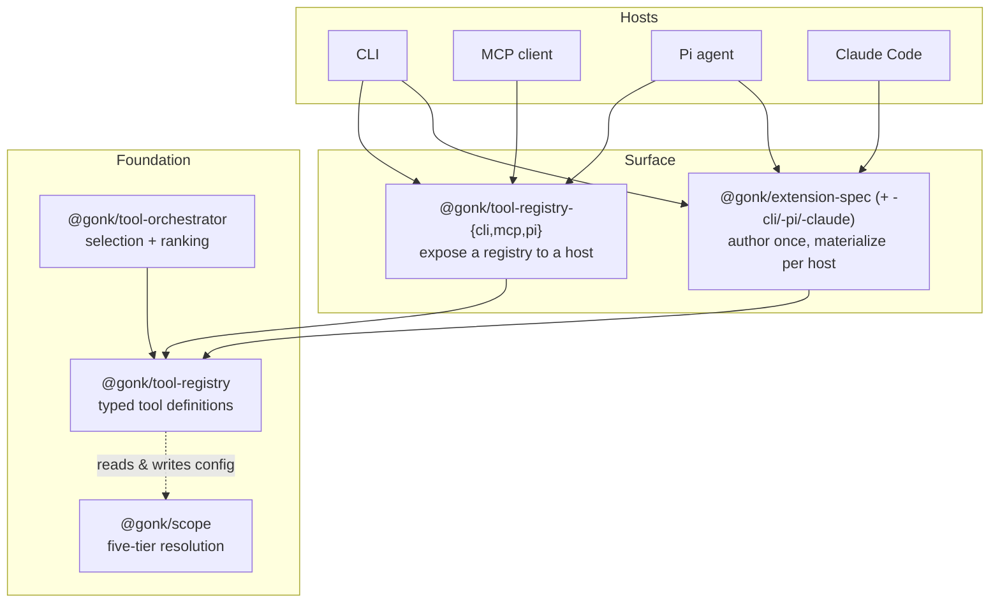
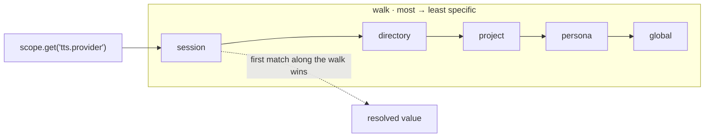

# gonk core

**A typed tool registry, a five-tier scope system, and host adapters — the foundation one persistent agent stands on as it moves between hosts.**

gonk separates *what a tool is* from *who is asking and where they are standing*. Define a tool once against a typed registry; expose it through a CLI, an MCP server, or a Pi agent without rewriting it; and let every tool read and write configuration through a single scope chain that resolves the same way everywhere.

Extracted from [gonk](https://github.com/nightwork-dev/gonk) for public release.

## Architecture



Three primitives, each its own package, plus an authoring layer on top of them:

- **Tool definitions** — [`@gonk/tool-registry`](packages/core/tool-registry). A tool is a typed handler with Standard Schema I/O and a self-declared approval tier (`read` / `write` / `exec`). The registry holds them; the core packages carry zero schema-library dependencies (an in-tree minimal adapter covers the schema shape).
- **Scope** — [`@gonk/scope`](packages/core/scope). One resolution chain, five tiers, multi-root and symlink-aware. Tools never invent their own config storage; they read and write namespaced keys through scope and inherit the resolution for free.
- **Adapters** — [`@gonk/tool-registry-{cli,mcp,pi}`](packages/adapters). Each exposes the *same* registry + orchestrator to a different host, so a capability ships once and surfaces everywhere.
- **Extension authoring** — [`@gonk/extension-spec`](packages/framework/extension-spec) (+ `-cli` / `-pi` / `-claude`). Declare a whole extension — slash commands, settings UIs, presets, and tools — as host-agnostic data, then materialize it into a CLI extension, a Pi extension, or a Claude Code plugin tree. Built on the two primitives above.

`@gonk/tool-orchestrator` sits on top of the registry for semantic selection (`find_tools`, `load_tool`, …) when a host carries more tools than it wants visible at once.

## Scope resolution

Every tool reads and writes state through one chain. With the tier unspecified, a read walks **most → least specific** and returns the first match; a write always names its tier. The same five tiers resolve identically across CLI, MCP, and Pi.



A worked example — Gimble, the example persona, keeps a voice preference at the persona tier, and a session override wins without erasing it:

```ts
import { FsScopeStore } from "@gonk/scope/fs";

const scope = new FsScopeStore({ cwd: process.cwd() });

scope.set("tts.provider", "mlx-cloning", "persona");  // Gimble's standing preference
scope.set("tts.provider", "openai", "session");        // a one-off override

scope.get("tts.provider");      // → "openai"  (session is most specific)
scope.resolve("tts.provider");  // → every tier where it is set, most → least specific
```

> Gimble keeps your config level no matter which host you tilt through — named for a gimbal, though it privately suspects that is a flattering story invented to cover a typo. It also knows it is the *default*: whoever is reading this almost certainly is not who made it, and it is quietly hoping you keep it around long enough to let it become someone in particular.

## Packages

| Package | What it is |
| --- | --- |
| `@gonk/scope` | Five-tier scoped key/value resolution (`session > directory > project > persona > global`). |
| `@gonk/tool-registry` | Typed tool definitions + registry, Standard Schema I/O, metrics sinks. |
| `@gonk/tool-orchestrator` | Semantic tool selection / ranking over a registry. |
| `@gonk/core` | A barrel over `@gonk/scope` + `@gonk/tool-registry` — one import for the common surface. |
| `@gonk/tool-registry-cli` | Expose a registry/orchestrator over a CLI. |
| `@gonk/tool-registry-mcp` | Expose a registry/orchestrator over the Model Context Protocol (stdio + `./http`). |
| `@gonk/tool-registry-pi` | Adapt registry tools to `@earendil-works/pi-agent-core` AgentTools. |
| `@gonk/extension-spec` | Declarative, host-agnostic extension spec — slash commands, settings, presets, and tools as data. |
| `@gonk/extension-spec-cli` | Materialize an ExtensionSpec into a CLI extension (subcommands, settings prompts, presets). |
| `@gonk/extension-spec-pi` | Materialize an ExtensionSpec into a Pi extension (tools, slash command, settings TUI). |
| `@gonk/extension-spec-claude` | Materialize an ExtensionSpec into a Claude Code plugin tree (plugin.json, commands, hooks). |

## Develop

```bash
pnpm install --frozen-lockfile   # replays the committed, cooldown-compliant lockfile
pnpm -r build
pnpm -r typecheck
pnpm test
```

## Maintaining the lockfile

A 7-day supply-chain cooldown (`minimumReleaseAge` in `pnpm-workspace.yaml`) refuses any dependency version published less than a week ago. It is a *verification* gate — pnpm does not auto-downgrade — so a plain `pnpm install` that re-resolves a just-published transitive dep will fail. Two escape hatches are already wired:

- **Excludes** for the pi/build-chain transitive surface core never ships (`@aws-sdk/*`, `@smithy/*`, `@google/*`, `protobufjs`, `@rollup/*`, `rollup`).
- **Overrides** pinning the MCP SDK's HTTP-transport deps (`hono`, `body-parser`) to the newest releases >7 days old.

To regenerate the lockfile (after a dependency bump), run the resolution once with the age check off, then re-verify with it on:

```bash
pnpm install --config.minimumReleaseAge=0   # resolve; lets overrides apply
pnpm install --frozen-lockfile              # authoritative: must pass the cooldown
```

The committed lockfile must always pass the second command. Frozen installs (CI, consumers) are unaffected by the cooldown beyond that check.
